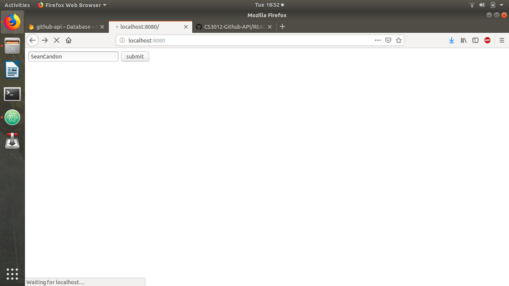
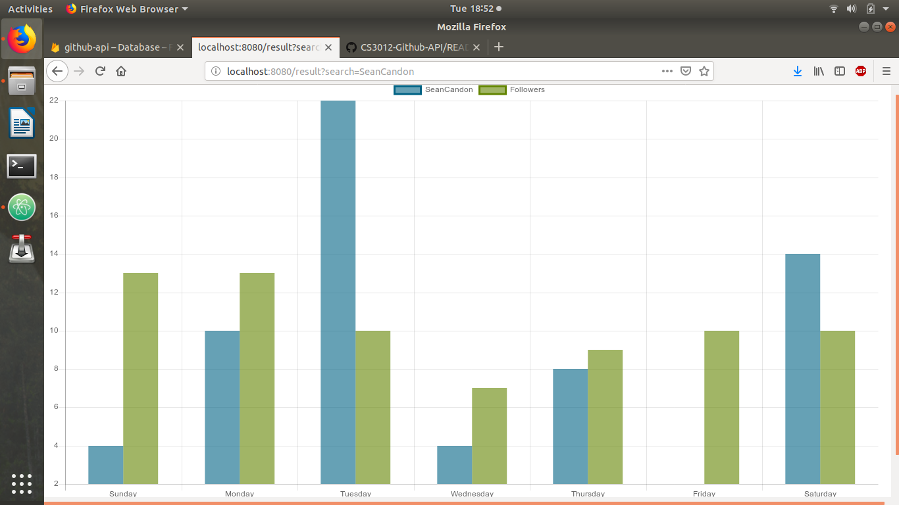

# CS3012-Github-API
Project that interrogates the Github API and displays user-defined data on a webpage

This web app asks a user to enter the name of a Github user. Returned to them will be a bar chart
displaying the total number of commits that user has made to their repos over the past year for
each day of the week. Also on this graph will be the average number of commits for each day
for the user's followers.

The github API is crawled by a python script, called gitInfo.py. This script retrieves the necessary
data and stores it in a firebase database.

A server called 'server.js' - which runs in Node.js - handles the get requests made by the client. It
calls the python script to run when the user searches for a Github user, and then retrieves data from
the firebase database and sends it to a html file ('pagr2.html') as json.

'home.html' is the page that handles the user search. It features a search bar. 'page2.html' displays the
graph. It is loaded only when the python script has ran and all the data has been retrieved from the
database. Only when the page has fully loaded does it attempt to create and display the graph.

Below are screenshots of the app working.

